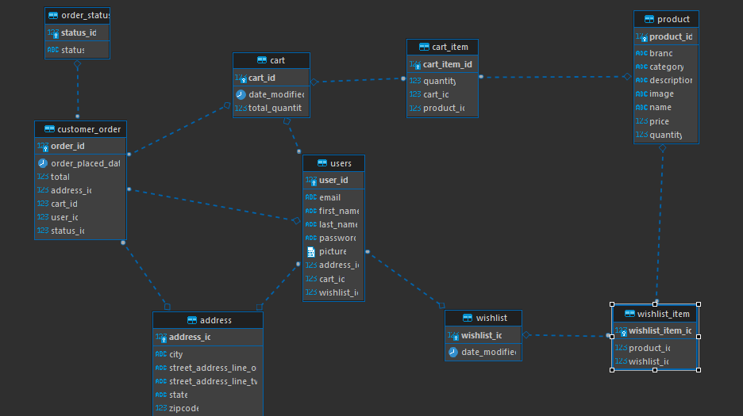
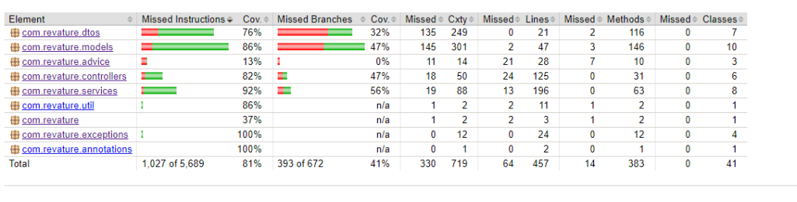

# E-Commerce-Backend
> This a web application project for developing an e-commerce website for musical instruments and other accessories. We use Spring Boot to build the back-end part and Angular for the front-end part. This Repository is for the back-end.

## User Stories 
- Users can view previous orders.
- Users can add and remove items from cart
- Users can register for account.
- Users can update account. 
- Users can checkout/place order.
- Users can add and remove items from wishlist.
- Users can view all products or filter by category or brand.

## How to run application locally  
1. Create a new database in a local database server.
2. Change the Application Properties (E.g. username/password of DB) present in ``resources/application.yml``  according to the newly created local database server.  
3. Run the Spring Boot application on any IDE of preference.
    - After running the application, database will be populated with tables.
4. Import and run SQL script to populate the Ecommerce database with data. 
5. (Optional) Go to http://localhost:8080/api/swagger-ui.html/ for documentation on endpoints and models.
    - Note documentation is only available after the start-up of the application.

**ERD**
 

 

**Testing** 
 

 
- Testing was done through JUnit and Mockito 
- Coverage of 81% 

## Tech stack 
- [ ] PostgreSQL for persistence
- [ ] API built with Java 8 and Spring 5
- [ ] Git SCM (hosted on GitHub)
- [ ] Testing built using JUnit & Mockito
- [ ] Jacoco for validation and measure of code coverage  

## Technology framework 
- [ ] Java API will leverage the Spring Framework
- [ ] Java API will use Spring Data JPA to communicate with the DB
- [ ] Java API will be RESTful (though HttpSession will be permitted)
- [ ] Java API will be unit tested using JUnit and Mockito
- [ ] Java API will will generate documentation with Spring REST Docs 

